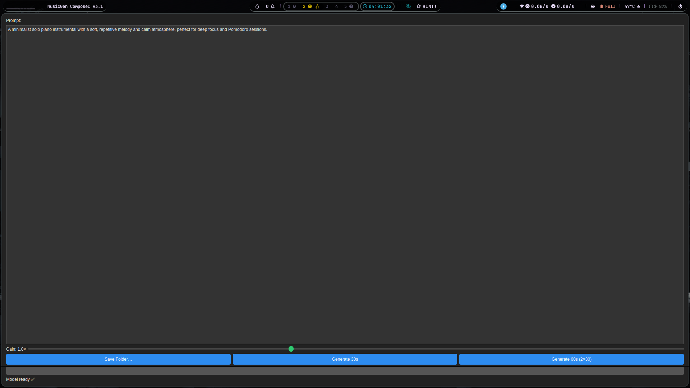

# 🎼 MusicGen Composer v3.1

> **Local PyQt desktop app** powered by Meta **MusicGen-medium** (AudioCraft).  
> Generate high-quality 30-second clips or stitched 60-second tracks completely offline on a single consumer GPU.

<div align="center">
  
</div>

---

## ✨ Highlights

| Feature | Details |
|---------|---------|
| **Offline**            | Works with a local `musicgen-medium` model – no API keys. |
| **30 s / 60 s**        | One 30-second clip **or** automatic **2 × 30 s** stitching (≈ 60 s). |
| **Dark PyQt GUI**      | Prompt box, gain slider, save-folder picker, live progress bar. |
| **RTX-friendly**       | FP16 + ≤ 1024-token cap prevents OOM on 8 GB GPUs (RTX 4060 OK). |
| **Dual output**        | Saves **WAV** *and* **MP3** with one click. |

---

## 🖥️ Quick Start

```bash
git clone https://github.com/devloper-gazi/MusicGen_v3.1.git
cd musicgen-composer
```

# (optional) virtual env
```bash
python -m venv .venv && source .venv/bin/activate      # Windows: .venv\Scripts\activate
```
# core deps  (CUDA 11.8 wheel shown)
```bash
pip install torch torchvision torchaudio --index-url https://download.pytorch.org/whl/cu118
pip install transformers pyqt5 scipy pydub
sudo apt install ffmpeg                                 # or: conda install "ffmpeg<5" -c conda-forge
```
# model (≈1.5 GB, needs git-lfs)
```bash
sudo apt install git-lfs && git lfs install
git clone https://huggingface.co/facebook/musicgen-medium models/musicgen-medium
```
# launch GUI
```bash
python generate_music_gui.py
```
```bash
# AudioCraft


```
AudioCraft is a PyTorch library for deep learning research on audio generation. AudioCraft contains inference and training code
for two state-of-the-art AI generative models producing high-quality audio: AudioGen and MusicGen.


## Installation
AudioCraft requires Python 3.9, PyTorch 2.1.0. To install AudioCraft, you can run the following:

```shell
# Best to make sure you have torch installed first, in particular before installing xformers.
# Don't run this if you already have PyTorch installed.
python -m pip install 'torch==2.1.0'
# You might need the following before trying to install the packages
python -m pip install setuptools wheel
# Then proceed to one of the following
python -m pip install -U audiocraft  # stable release
python -m pip install -U git+https://git@github.com/facebookresearch/audiocraft#egg=audiocraft  # bleeding edge
python -m pip install -e .  # or if you cloned the repo locally (mandatory if you want to train).
python -m pip install -e '.[wm]'  # if you want to train a watermarking model
```

We also recommend having `ffmpeg` installed, either through your system or Anaconda:
```bash
sudo apt-get install ffmpeg
# Or if you are using Anaconda or Miniconda
conda install "ffmpeg<5" -c conda-forge
```

## Virtual Environment

It is recommended to work within a dedicated Python virtual environment to keep
dependencies isolated. You can create one using `venv`:

```bash
python3 -m venv venv
source venv/bin/activate
```

Alternatively, you can use Conda:

```bash
conda create -n audiocraft python=3.9
conda activate audiocraft
```

Once activated, follow the installation commands above.

## Models

At the moment, AudioCraft contains the training code and inference code for:
* [MusicGen](./audiocraft/docs/MUSICGEN.md): A state-of-the-art controllable text-to-music model.
* [AudioGen](./audiocraft/docs/AUDIOGEN.md): A state-of-the-art text-to-sound model.
* [EnCodec](./audiocraft/docs/ENCODEC.md): A state-of-the-art high fidelity neural audio codec.
* [Multi Band Diffusion](./audiocraft/docs/MBD.md): An EnCodec compatible decoder using diffusion.
* [MAGNeT](./audiocraft/docs/MAGNET.md): A state-of-the-art non-autoregressive model for text-to-music and text-to-sound.
* [AudioSeal](./audiocraft/docs/WATERMARKING.md): A state-of-the-art audio watermarking.
* [MusicGen Style](./audiocraft/docs/MUSICGEN_STYLE.md): A state-of-the-art text-and-style-to-music model.
* [JASCO](./audiocraft/docs/JASCO.md): "High quality text-to-music model conditioned on chords, melodies and drum tracks"


## Training code

AudioCraft contains PyTorch components for deep learning research in audio and training pipelines for the developed models.
For a general introduction of AudioCraft design principles and instructions to develop your own training pipeline, refer to
the [AudioCraft training documentation](./audiocraft/docs/TRAINING.md).

For reproducing existing work and using the developed training pipelines, refer to the instructions for each specific model
that provides pointers to configuration, example grids and model/task-specific information and FAQ.


## API documentation

We provide some [API documentation](https://facebookresearch.github.io/audiocraft/api_docs/audiocraft/index.html) for AudioCraft.


## Execution and GUI

After installing the package you can generate music through command line scripts
or graphical interfaces.

### Gradio demos
The `audiocraft/demos` folder contains several [Gradio](https://www.gradio.app/)
applications. To launch the MusicGen demo locally run:

```bash
python -m audiocraft.demos.musicgen_app --share
```

Add `--share` to create a publicly shareable link. Similar commands can be used
for `magnet_app.py` and `jasco_app.py`.

### PyQt GUI
If you prefer a desktop application, run the PyQt interface:

```bash
python audiocraft/generate_music.py
```

This opens a window where you can type prompts and generate short clips
offline.

## FAQ

#### Is the training code available?

Yes! We provide the training code for [EnCodec](./audiocraft/docs/ENCODEC.md), [MusicGen](./audiocraft/docs/MUSICGEN.md),[Multi Band Diffusion](./audiocraft/docs/MBD.md) and [JASCO](./audiocraft/docs/JASCO.md).

#### Where are the models stored?

Hugging Face stored the model in a specific location, which can be overridden by setting the `AUDIOCRAFT_CACHE_DIR` environment variable for the AudioCraft models.
In order to change the cache location of the other Hugging Face models, please check out the [Hugging Face Transformers documentation for the cache setup](https://huggingface.co/docs/transformers/installation#cache-setup).
Finally, if you use a model that relies on Demucs (e.g. `musicgen-melody`) and want to change the download location for Demucs, refer to the [Torch Hub documentation](https://pytorch.org/docs/stable/hub.html#where-are-my-downloaded-models-saved).


## License
* The code in this repository is released under the MIT license as found in the [LICENSE file](./audiocraft/LICENSE).
* The models weights in this repository are released under the CC-BY-NC 4.0 license as found in the [LICENSE_weights file](./audiocraft/LICENSE_weights).


## Citation

For the general framework of AudioCraft, please cite the following.
```
@inproceedings{copet2023simple,
    title={Simple and Controllable Music Generation},
    author={Jade Copet and Felix Kreuk and Itai Gat and Tal Remez and David Kant and Gabriel Synnaeve and Yossi Adi and Alexandre Défossez},
    booktitle={Thirty-seventh Conference on Neural Information Processing Systems},
    year={2023},
}
```

When referring to a specific model, please cite as mentioned in the model specific README, e.g
[./audiocraft/docs/MUSICGEN.md](./audiocraft/docs/MUSICGEN.md), [./audiocraft/docs/AUDIOGEN.md](./audiocraft/docs/AUDIOGEN.md), etc.
